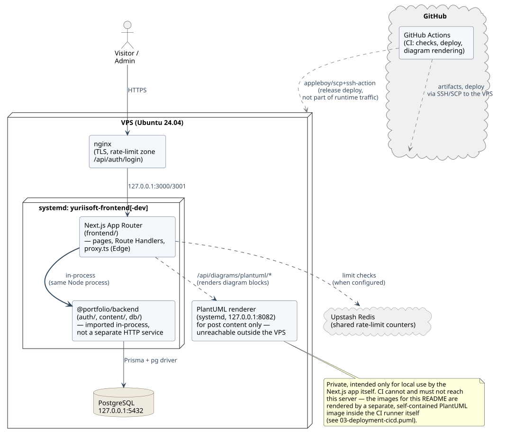
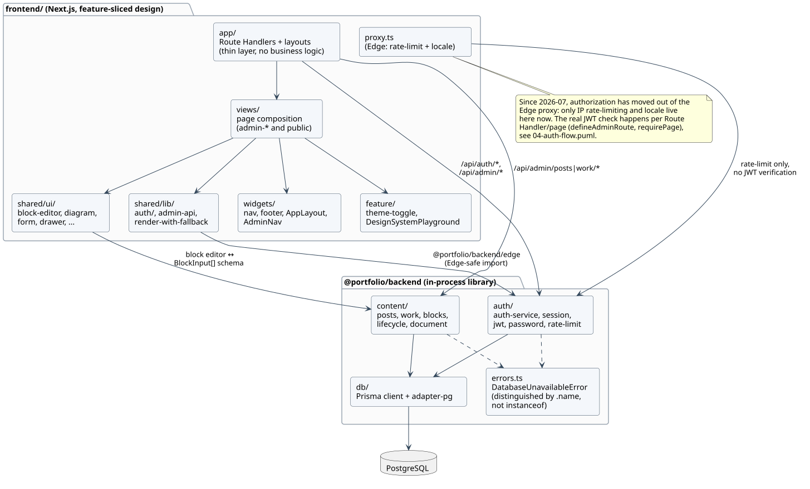
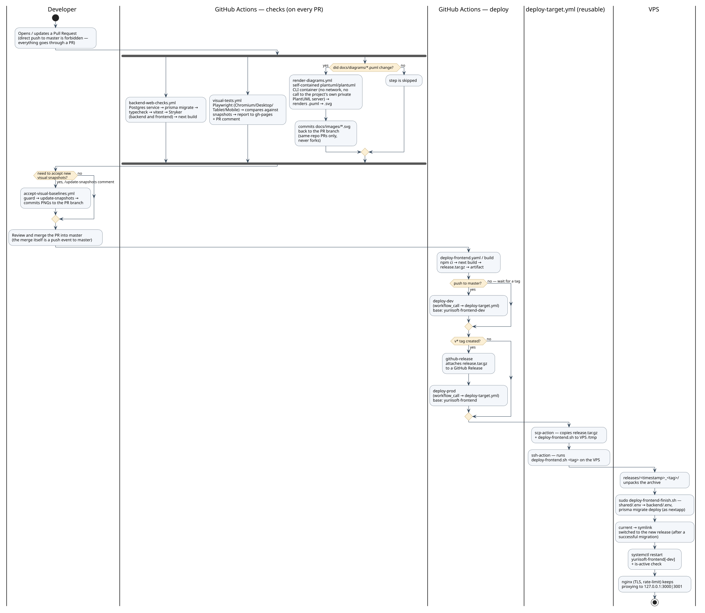
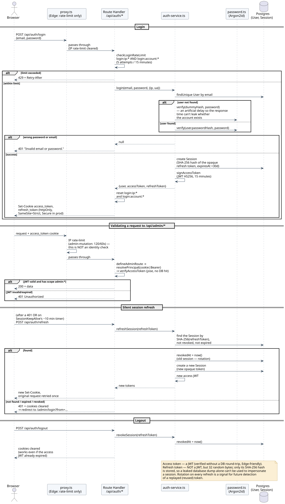
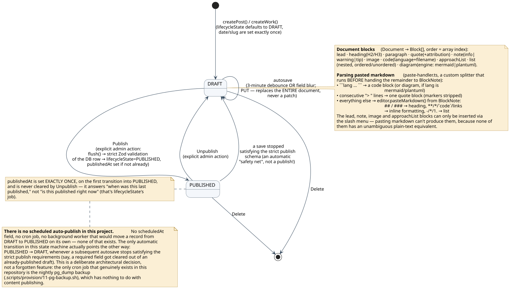

[](https://github.com/yuriisurzhykov/Portfolio-Website/actions/workflows/deploy-frontend.yaml)
[](https://github.com/yuriisurzhykov/Portfolio-Website/actions/workflows/visual-tests.yml)
[](https://github.com/yuriisurzhykov/Portfolio-Website/actions/workflows/backend-web-checks.yml)
[](https://github.com/yuriisurzhykov/Portfolio-Website/actions/workflows/github-code-scanning/codeql)

# Portfolio Website

A program, much like a book, deserves to be read before it is judged — and
this `README.md` exists precisely for that first, most honest reading, the
one that rarely belongs to the author but almost always to some accidental
visitor who opens the repository for the first time and finds nothing
inside but a row of naked build badges. That visitor will not be left
empty-handed any longer: what follows is not a recitation of the directory
tree, but a map of the territory, drawn so that it explains the system
through its actual, load-bearing relationships rather than through
optimistic promises that rarely survive a first refactor — a map of the
road this portfolio site has travelled from a static Vite single-page
application to a full Next.js application with a real database, its own
content-management system, and a deployment pipeline onto a dedicated
server.

## Table of contents

- [What this project is](#what-this-project-is)
- [The big picture: building blocks](#the-big-picture-building-blocks)
- [Components, one level deeper](#components-one-level-deeper)
- [Technology stack](#technology-stack)
- [CI/CD and deployment](#cicd-and-deployment)
- [Authentication: why a sequence diagram, specifically](#authentication-why-a-sequence-diagram-specifically)
- [Posts, work items, and how the editor reads pasted markdown](#posts-work-items-and-how-the-editor-reads-pasted-markdown)
- [Local development quick start](#local-development-quick-start)
- [Testing and quality](#testing-and-quality)
- [Map of the rest of the documentation](#map-of-the-rest-of-the-documentation)
- [How the diagrams in this file stay honest](#how-the-diagrams-in-this-file-stay-honest)

## What this project is

Formally, this is a monorepo holding two npm workspace packages: `frontend/`
— a Next.js application on the App Router, answering simultaneously for the
public site and for the administrative CMS — and `backend/` (published
internally as `@portfolio/backend`), a package of domain logic (the Prisma
schema, authentication, content services) that `frontend/` pulls in not
over the network, but as an ordinary library living in the very same
Node.js process. That distinction — "a library inside the process" versus
"a service reached over HTTP" — looks like an implementation detail at
first glance, yet it is exactly what shapes nearly every diagram below:
wherever a reader might expect an arrow labeled REST or GraphQL, they will
instead find only a quiet, in-process function call, because `backend/` is
not an interlocutor one addresses across a network, but rather a
well-trained secretary who never once leaves the office of their single
employer.

At its core, the whole project is a personal site with a blog ("Journal")
and a portfolio of projects ("Work") that simply outgrew itself, to the
point of demanding a CMS, authentication, a proper data schema, and a
genuinely serious delivery pipeline of its own. It began as a static Vite
single-pager; not one line of that survives today — only the lesson,
carried forward in `frontend/README.md`'s own decision log.

## The big picture: building blocks

If authentication is best described by a sequence diagram (a question
raised on purpose, and answered in its own section below), then the
natural choice for the whole system's silhouette is a component diagram
at the level of "what is this made of and who talks to whom" — a diagram
that answers "what is this fundamentally built from," not "how exactly is
it built."



The one thing this picture must communicate at a glance: there is exactly
one process accepting HTTP traffic from a visitor (Next.js, under
systemd), and everything that looks like "a separate service" —
PostgreSQL, the self-hosted PlantUML renderer used for diagram blocks
inside posts, Upstash Redis for shared rate-limit counters — serves that
single process, and never serves the browser directly. The PlantUML server
deserves a warning of its own here: it is private, bound to `127.0.0.1` on
that same VPS, and exists solely so the site's administrator can drop a
`plantuml`/`mermaid` diagram into a post's body — the very CI that
regenerates the picture above never talks to that server at all, and is
not meant to (see `docs/README.md`).

## Components, one level deeper

Descending one level further, while still refusing to touch individual
files, one can see how `frontend/`'s feature-sliced layers fan out from
`app/` (a thin layer of routes and Route Handlers that, by design, is not
supposed to carry business logic — that all lives elsewhere), and how
`@portfolio/backend` splits into `auth/`, `content/`, and `db/`, exporting
itself through two separate entry points at once: an ordinary `index.ts`
for the Node runtime, and a trimmed-down `edge.ts` for the Edge proxy,
which simply has no access to Prisma or `node:crypto` by the very nature
of the Edge runtime.



The dashed link between `errors.ts` and both `auth/` and `content/` is not
decoration: a database-unavailability error (`DatabaseUnavailableError`) is
told apart by its class name, not by an `instanceof` check, because
Turbopack compiles `@portfolio/backend` anew for every execution context
(a Server Component and a Route Handler are different bundles of the exact
same source file), and `instanceof` simply does not survive that boundary
— a detail worth remembering before "fixing" a mysterious bug with a single
`instanceof` guard.

## Technology stack

| Layer | Tools |
|---|---|
| Frontend | Next.js 16 (App Router), React 19, TypeScript, Tailwind CSS v4 |
| Content editor | BlockNote (ProseMirror/Tiptap) + Mantine, a custom trimmed-down block schema |
| Backend package | Prisma 7 (`@prisma/adapter-pg`), PostgreSQL 16, Zod 4, `jose` (JWT), `argon2` |
| Infrastructure | nginx (TLS, rate-limiting), systemd, a self-hosted PlantUML renderer, optionally Upstash Redis |
| Tests | Vitest (unit/integration), StrykerJS (mutation testing), Playwright (visual and a11y tests) |
| CI/CD | GitHub Actions, deployment over SSH/SCP to a VPS, GitHub Pages — for Playwright reports only |

## CI/CD and deployment

If the building blocks in the previous section were a photograph of a
building, this section is the chronicle of its everyday life: how code
that someone just finished writing on a laptop ends up as a running
process on a real server, and exactly what gets checked along the way
before that is allowed to happen. A direct `push` to `master` is forbidden
by this repository's own rules — the only way out is through a Pull
Request — so the diagram below reads not as server topology, but as the
route a single change takes through several parallel checks, a merge, and
only then a genuinely different path for an ordinary merge (the `dev`
environment) versus a `v*` tag (the `prod` environment).



Three details that are easy to miss here, yet worth a sentence each:

- The build happens exactly once, in `deploy-frontend.yaml`'s `build` job;
  what travels to the VPS over SSH is already a finished `release.tar.gz`
  archive — the server only unpacks it and restarts the systemd unit,
  never building Next.js on itself.
- `prisma migrate deploy` runs on the VPS before the `current` symlink
  switches over to the new release — if the migration fails, the previous
  release keeps serving traffic instead of being replaced by a half-migrated
  database.
- Regenerating the diagrams for this very README is also, literally and
  not merely metaphorically, part of CI/CD: `render-diagrams.yml` runs
  through the exact same Pull Request mechanism as every other check,
  filtered only by the `docs/diagrams/**` path (more on this in the last
  section of this file).

## Authentication: why a sequence diagram, specifically

Before showing the picture itself, it is worth answering the question that
preceded its existence: which kind of diagram is even appropriate here?
UML offers several candidates for this, and the choice between them is not
a matter of taste but a consequence of exactly which question the diagram
is meant to settle. A state diagram would show beautifully what state a
*session by itself* is in — alive, expired, revoked — but authentication is
not one state; it is an exchange of replies between several independent
participants (the browser, the Edge proxy, a particular Route Handler, the
auth service, the database), and who exactly initiates each step matters
just as much as what happens inside each step. An activity diagram would
show a single scenario end-to-end, but would erase the boundaries between
participants — and it is precisely those boundaries that answer "who,
exactly, can be trusted with a JWT, and who cannot." A sequence diagram is
therefore the right tool here: it alone holds time, roles, and causality
together at once, which is, essentially, the definition of what an
authentication protocol is.



The scheme here is deliberately hybrid, and in that sense a compromise
rather than an accident: the access token is an ordinary JWT (`jose`,
HS256, living for 15 minutes), verified without a single trip to the
database, which is exactly what makes it friendly to the Edge runtime;
the refresh token, by contrast, is not a JWT at all, but 32 random bytes
whose SHA-256 hash sits in the `Session` table — because the ability to
revoke one particular session (or every session at once) already requires
a database round-trip regardless, and once that round-trip is unavoidable,
encoding the refresh token as a self-verifying JWT would be extra
complexity bought for no benefit whatsoever. `frontend/src/proxy.ts` itself
(the renamed `middleware.ts` of Next.js 16's own vocabulary) has, since
2026, stopped checking identity altogether — it only throttles requests by
IP; the real JWT check has been deliberately pushed down to the level of
every individual Route Handler and page (`defineAdminRoute`/`requirePage`),
because an Edge proxy fundamentally sees nothing beyond the shape of a URL,
and trusting it with the decision "let this through or not" would mean
trusting that decision to the one participant in the conversation who
knows the least about its context.

## Posts, work items, and how the editor reads pasted markdown

Honesty has to come before elegance here: there is no scheduled
auto-publish anywhere in this system — no `scheduledAt` field, no cron job,
no background worker quietly promoting a draft into a published record
without a human involved. The only transition in this state machine that
is genuinely *automatic* points the other way entirely: if a subsequent
autosave of a draft stops satisfying the strict requirements for
publication (say, a required field got cleared out of an already-published
post), the system moves it back to `DRAFT` on its own — this is not an
unfinished, forgotten feature, but a deliberate safety net, spelled out in
plain words right inside `backend/src/content/lifecycle.ts`: "not doing this
now." A state diagram is the right choice here precisely because a post's
or a work item's record genuinely has a small, closed set of states with
clearly defined transitions between them, rather than a continuous stream
of events that an activity diagram would describe better.



Autosave runs on a three-minute debounce (plus a forced flush on a form
field losing focus, before publishing, and before deletion), and it always
rewrites the entire document rather than patching a part of it — a
decision justified by the fact that this project has exactly one editor,
a single administrator, which makes the risk of two simultaneous edits to
the same document a risk not worth paying for with the complexity of
versioning. Parsing pasted markdown is built as a small, deliberately
incomplete pipeline: a custom splitter in `paste-handler.ts` intercepts
only what BlockNote's own stock `pasteMarkdown` is known not to be able to
turn into a block of this trimmed-down schema — triple backticks become a
code block, or a diagram block depending on the language tag given, and
consecutive lines starting with `> ` get merged into a single blockquote;
everything else — headings, lists, inline formatting — still flows through
BlockNote's standard path, and reaching in there with custom code would
simply be reinventing something that already works.

## Local development quick start

```bash
# 1. Local Postgres and (optionally) a local PlantUML renderer
docker compose up -d

# 2. Dependencies for the whole workspace — from the repo root, not frontend/
npm install

# 3. Environment variables for the backend package
cp backend/.env.example backend/.env

# 4. Apply the schema migrations
cd backend && npx prisma migrate dev

# 5. The one administrator — interactively, so no secrets land in shell history
npm run create-admin

# 6. The site itself
cd ../frontend && npm run dev
```

## Testing and quality

Unit and integration tests (Vitest) in `backend/` and `frontend/` run on
every Pull Request and every push to `master`; but line coverage alone is
a metric well known to lie: a test that calls a function and asserts
nothing meaningful drives coverage to a hundred percent while catching not
a single real bug. That is why, alongside Vitest, this repository makes
StrykerJS a mandatory step — mutation testing, which deliberately damages
the source code (flips `<` into `<=`, removes a `return`, swaps a boolean
literal) and checks whether even one test actually reacts by failing.
Running on its own track is Playwright, taking visual and accessibility
snapshots of pages and of individual components from `/storybook`,
accepted into a PR through a `/update-snapshots` comment rather than an
automatic commit — because the judgment "this is no longer a regression,
but a deliberate design change" is, by its very nature, a human one, not
something worth delegating to a machine.

Supply-chain hygiene sits alongside these: `npm audit --audit-level=high`
runs as a blocking step in the same CI job, and
[Dependabot](.github/dependabot.yml) keeps both the npm workspace and the
GitHub Actions themselves current on a weekly cadence.

## Map of the rest of the documentation

This file is an overview, not the final word: nearly every meaningful slice
of code in this repository carries its own `README.md` with a log of
decisions — including the dead ends that led to the final answer, not only
the answer itself. A good place to continue is here:

- [`backend/README.md`](backend/README.md) — how the `@portfolio/backend` package is put together, local setup from scratch.
- [`backend/src/auth/README.md`](backend/src/auth/README.md) — the full reasoning behind the JWT + opaque refresh-token scheme.
- [`backend/src/content/README.md`](backend/src/content/README.md) — the `Document`/`Block` model, and why a case study is a document rather than its own entity.
- [`backend/src/db/README.md`](backend/src/db/README.md) — the Prisma client, and handling database unavailability.
- [`frontend/README.md`](frontend/README.md) — how the Next.js application is structured, and the history of the move away from Vite.
- [`frontend/src/shared/lib/auth/README.md`](frontend/src/shared/lib/auth/README.md) — why the JWT check no longer lives in the Edge proxy.
- [`frontend/src/shared/ui/block-editor/README.md`](frontend/src/shared/ui/block-editor/README.md) — how the BlockNote-based block editor is built.
- [`frontend/src/shared/ui/diagram/README.md`](frontend/src/shared/ui/diagram/README.md) — how diagram blocks inside posts get rendered (that same private PlantUML server).
- [`frontend/tests/README.md`](frontend/tests/README.md) — visual and accessibility tests, and the `/update-snapshots` convention.
- [`.scripts/provision/README.md`](.scripts/provision/README.md) — provisioning the VPS from scratch: systemd, nginx, backups.
- [`docs/README.md`](docs/README.md) — how this very file's diagram-regeneration pipeline is put together.

## How the diagrams in this file stay honest

None of the five pictures above is ever edited as a picture. The source of
truth is the plain-text `.puml` files in [`docs/diagrams/`](docs/diagrams),
and the SVGs in [`docs/images/`](docs/images) are strictly a derived,
automatically rebuilt artifact — in the very same spirit in which
`frontend/tests/visual-snapshots/` is not something touched by hand in an
image editor. Editing a diagram looks like this: change the relevant
`.puml` file, open a Pull Request, and the
[`render-diagrams.yml`](.github/workflows/render-diagrams.yml) workflow
renders every diagram itself, using the official, public `plantuml/plantuml`
image (self-contained, never reaching out to this same project's own
private PlantUML server — that one exists only for diagram blocks inside
posts, and is unreachable outside the VPS), then commits the resulting SVGs
straight back to that same PR's branch. The full reasoning behind this
scheme, including why this renderer was chosen over any other, lives in
[`docs/README.md`](docs/README.md).
