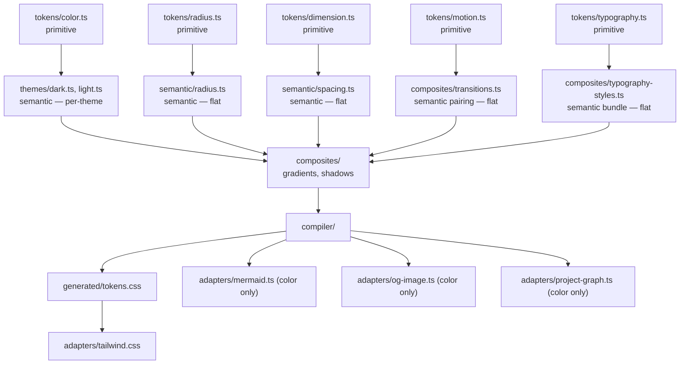
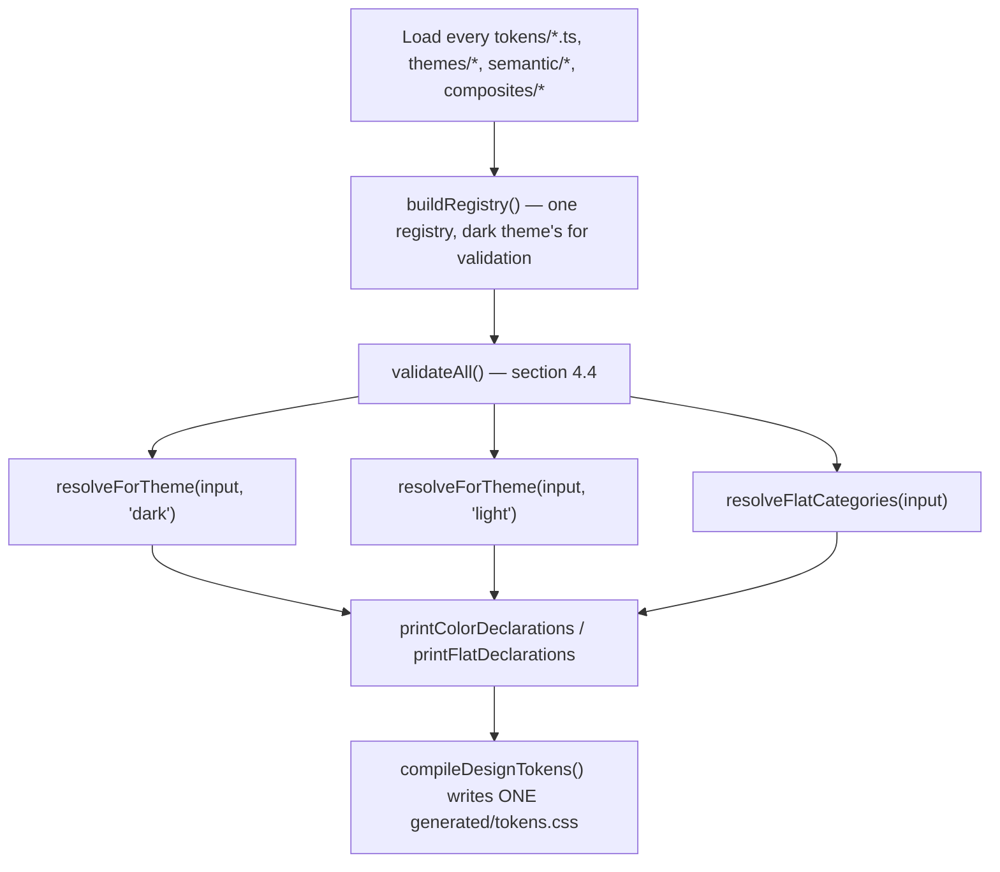

# Design Token Architecture (`shared/ui/theme`)

Next.js + Tailwind CSS v4 + Mermaid + `next/og` + WebGL

**Goal**: one platform-neutral TypeScript source of truth for every reusable design value — color, dimension, radius, typography, motion, shadow — with a small compiler that resolves references and generates CSS, plus adapters for Tailwind and every non-CSS consumer.

**Core rule**: application code consumes semantic tokens or (later) component tokens — never a raw value. A raw hex/`rgb()`, an arbitrary `rounded-[7px]`, a one-off `duration-[180ms]`, or a hand-copied shadow color are defects, not style choices.

**Status of each category** — this document specifies the full shape for all of them; only **color** has had the dedicated review (duplicate-check, hue-consistency audit, naming pass) this architecture exists to enforce. The rest are shown with their real, current values carried over as-is from today's flat `tokens.ts` into the new shape — not yet re-reviewed, not yet exposed to the compiler/validator, but structurally in place so a future review doesn't require a second migration:

| Category | Has a theme axis | Review status |
|---|---|---|
| Color | Yes | Reviewed (section 3.1/3.7) |
| Dimension / spacing | No | Not yet reviewed — current values, new location (section 3.2) |
| Radius | No | Not yet reviewed (section 3.3) |
| Typography | No | Not yet reviewed (section 3.4) |
| Motion | No | Not yet reviewed (section 3.5) |
| Shadow | No (embeds color — see section 3.6) | Not yet reviewed, but its color dependency is fixed now |

## 1. Architecture at a glance

```
frontend/src/shared/ui/theme/
├── tokens/
│   ├── color.ts               Primitive color scales — reviewed.
│   ├── dimension.ts             Primitive numeric scale spacing/sizing draw from.
│   ├── radius.ts                  Primitive corner-radius scale.
│   ├── typography.ts                Primitive font family/weight/size/line-height/tracking.
│   └── motion.ts                      Primitive duration/easing/scale values.
├── themes/
│   ├── dark.ts                          Semantic COLOR roles, dark theme — color's
│   │                                    semantic layer, split by theme because color
│   │                                    is the one category whose roles actually
│   │                                    differ by theme. See section 2.
│   ├── light.ts
│   └── index.ts
├── semantic/
│   ├── radius.ts                          Semantic ROLES over tokens/radius.ts
│   │                                      ("control", "card", ...) — every category
│   │                                      gets this layer; radius/dimension/motion's
│   │                                      versions just don't split by theme, unlike
│   │                                      themes/ above. See section 2.
│   └── spacing.ts                           Semantic roles over tokens/dimension.ts
│                                            ("inlineSm", "stackMd", "sectionLg", ...).
├── composites/
│   ├── gradients.ts                       Structured gradient recipes (color).
│   ├── typography-styles.ts                 Semantic text styles (hero/display/h1/...),
│   │                                        each a named bundle of typography primitives.
│   └── shadows.ts                            Structured shadow layers, referencing color
│                                              via `alpha()` — never a hardcoded copy.
├── compiler/
│   ├── types.ts
│   ├── references.ts                          Resolves "{category.path}" strings.
│   ├── validate.ts                              Reference resolution, cycles,
│   │                                            color-theme parity, category-specific
│   │                                            invariants.
│   ├── resolve.ts
│   ├── serializers/
│   │   ├── css-value.ts
│   │   ├── gradient.ts
│   │   └── shadow.ts
│   ├── generate-css.ts
│   └── index.ts
├── adapters/
│   ├── tailwind.css                             @theme mapping for EVERY category —
│   │                                            the only Tailwind-aware file in this tree.
│   ├── mermaid.ts                                 Color only — Mermaid has no motion/
│   │                                              spacing concept of its own.
│   ├── og-image.ts                                  Color only, same reason.
│   └── project-graph.ts                               Color only, same reason.
└── generated/
    └── tokens.css                                       One file, every category.
```

`tokens/` holds primitives — no UI meaning, just "what value exists." `themes/`/`semantic/` hold values that give a primitive a named ROLE — "what this value means," not just "what it is." `composites/` holds structured recipes built from one or more semantic/primitive values. `compiler/` resolves references, validates the graph, and serializes. `adapters/` is the only place anything Tailwind-, Mermaid-, or satori-specific is allowed to exist. `generated/` is a disposable artifact, never hand-edited, CI-checked for staleness (section 9).

## 2. Four layers, not three — and why only color's semantic layer splits by theme

The real chain is **primitive → semantic → composite → (optional) component**. Every category gets a semantic layer — "no theme axis" is not the same claim as "no semantic layer," and an earlier draft of this document conflated the two. `tokens/radius.ts`'s `md` step doesn't mean anything on its own; `semantic/radius.ts`'s `control` role saying "controls use `{radius.md}`" is what gives it meaning — the same relationship `themes/dark.ts`'s `surfacePrimary` role has to `tokens/color.ts`'s `neutral.950` step.

The ONLY thing that differs for color: its semantic layer's roles resolve to a *different* primitive step depending on theme, so color's semantic layer needs two variants (`themes/dark.ts` / `themes/light.ts`) instead of one flat file. Radius/spacing/typography/motion's semantic roles mean the same thing regardless of theme, so their semantic layer is one flat file each (`semantic/radius.ts`, `semantic/spacing.ts`) — a smaller layer, not a missing one.



Dependencies point downward only, for every category. `tokens/`, `themes/`, `semantic/`, and `composites/` must never import anything Tailwind-, Mermaid-, or satori-specific.

**An honest caveat, not glossed over**: our current `tokens/radius.ts`/`tokens/dimension.ts` scale steps are already named semantically (`xs`/`sm`/`md`/`lg`), not a generic numbered index (`0`/`1`/`2`...) the way the reference architecture's `dimension` scale is. That means `semantic/radius.ts`'s `control = "{radius.md}"` looks almost redundant next to the primitive it points to — the real payoff only shows up the day a role needs to move independently (e.g. every card gets a bigger radius without "`lg`" changing meaning everywhere else it's used). Adding this layer now, even while it looks like a thin pass-through, is what makes that day a one-line change instead of a grep-and-replace across every component using `rounded-lg` today.

## 3. Token layers and responsibilities

### 3.1 Color primitives — `tokens/color.ts` (reviewed)

Every value is a plain `hsl()` **string**, not a decomposed `{h, s, l}` object — a string literal gets IDE-native color-swatch highlighting, an object shape does not.

```ts
// tokens/color.ts
export const color = {
    // NEUTRAL — single cool hue (219°). An earlier version of this design
    // mixed a cool dark-theme surface with warm dark-theme text — an
    // inconsistency in the original design export, not intentional. One
    // hue, both themes, fixes it.
    neutral: {
        0: "hsl(219 0% 100%)", 50: "hsl(219 20% 91%)", 100: "hsl(219 20% 82%)",
        200: "hsl(219 20% 73%)", 300: "hsl(219 20% 64%)", 400: "hsl(219 20% 55%)",
        500: "hsl(219 20% 46%)", 600: "hsl(219 20% 37%)", 700: "hsl(219 20% 28%)",
        800: "hsl(219 20% 19%)", 900: "hsl(219 20% 10%)", 950: "hsl(219 25% 5%)",
    },
    // BRAND — hue 20°, 500 = the real brand accent. (Originally miscomputed
    // as hue 45° by reading OKLCH's hue angle as if it were HSL's — the two
    // color spaces don't share a hue mapping. The real value, from a full
    // OKLCH→OKLab→linear-sRGB→sRGB→HSL conversion, is hue 20°.)
    brand: {
        50: "hsl(20 95% 96%)", 100: "hsl(20 92% 91%)", 200: "hsl(20 90% 83%)",
        300: "hsl(20 92% 74%)", 400: "hsl(20 95% 66%)", 500: "hsl(20 94% 61%)",
        600: "hsl(20 90% 52%)", 700: "hsl(20 88% 43%)", 800: "hsl(20 85% 33%)",
        900: "hsl(20 82% 22%)", 950: "hsl(20 80% 13%)",
    },
    success: {
        50: "hsl(131 60% 96%)", 100: "hsl(131 55% 90%)", 200: "hsl(131 50% 82%)",
        300: "hsl(131 52% 75%)", 400: "hsl(131 52% 71%)", 500: "hsl(131 53% 67%)",
        600: "hsl(131 55% 56%)", 700: "hsl(131 58% 44%)", 800: "hsl(131 62% 32%)",
        900: "hsl(131 68% 21%)", 950: "hsl(131 72% 12%)",
    },
    warning: {
        50: "hsl(37 75% 96%)", 100: "hsl(37 72% 90%)", 200: "hsl(37 70% 82%)",
        300: "hsl(37 72% 74%)", 400: "hsl(37 74% 69%)", 500: "hsl(37 75% 64%)",
        600: "hsl(37 78% 54%)", 700: "hsl(37 80% 42%)", 800: "hsl(37 82% 30%)",
        900: "hsl(37 85% 20%)", 950: "hsl(37 88% 12%)",
    },
    // DANGER — entirely new; the pre-migration design had no distinct
    // danger color, status-error was aliased to warning.
    danger: {
        50: "hsl(0 85% 97%)", 100: "hsl(0 82% 92%)", 200: "hsl(0 80% 85%)",
        300: "hsl(0 78% 76%)", 400: "hsl(0 76% 68%)", 500: "hsl(0 74% 60%)",
        600: "hsl(0 70% 50%)", 700: "hsl(0 68% 42%)", 800: "hsl(0 65% 32%)",
        900: "hsl(0 62% 22%)", 950: "hsl(0 60% 12%)",
    },
    accent: { purple: "hsl(255 100% 82%)", blue: "hsl(211 100% 74%)", magenta: "hsl(316 55% 52%)" },
    // `codePanel` (CodeBlock's own background/border/hover tones) removed
    // from here — it was one component's vocabulary living in the shared
    // primitive tier, the same mistake as `code*` in themes/dark.ts below.
    // Needs a real component-token design first; not invented here.
    // OVERLAY — alpha only, NOT a color scale: one step number is the same
    // visual intensity over either base; the THEME picks the base, never
    // the intensity.
    overlayWhite: {
        4: "hsl(0 0% 100% / 4%)", 8: "hsl(0 0% 100% / 8%)", 12: "hsl(0 0% 100% / 12%)",
        16: "hsl(0 0% 100% / 16%)", 20: "hsl(0 0% 100% / 20%)", 24: "hsl(0 0% 100% / 24%)",
        32: "hsl(0 0% 100% / 32%)", 48: "hsl(0 0% 100% / 48%)",
    },
    overlayBlack: {
        4: "hsl(0 0% 0% / 4%)", 8: "hsl(0 0% 0% / 8%)", 12: "hsl(0 0% 0% / 12%)",
        16: "hsl(0 0% 0% / 16%)", 20: "hsl(0 0% 0% / 20%)", 24: "hsl(0 0% 0% / 24%)",
        32: "hsl(0 0% 0% / 32%)", 48: "hsl(0 0% 0% / 48%)",
    },
    // SCRIM — composited against each theme's OWN primary hue, not plain
    // white/black like overlay above — that's why it's a separate category.
    scrim: { dark: "hsl(219 25% 5% / 85%)", light: "hsl(219 0% 100% / 85%)" },
    // PATTERN — a decorative two-tone hatch for one placeholder-cover
    // illustration. Per-theme (a dark hatch on a light cover would look
    // broken); deliberately not part of the neutral scale.
    pattern: {
        darkPrimary: "hsl(219 15% 10%)", darkSecondary: "hsl(219 15% 8%)",
        lightPrimary: "hsl(219 20% 91%)", lightSecondary: "hsl(219 15% 96%)",
    },
} as const;
```

There is no separate "tint" primitive. A tint is "an existing step at reduced opacity," expressed via the `alpha()` helper (section 4) — the same mechanism a gradient stop's `opacity` or a shadow's color (section 3.6) compiles through. One mechanism for "this color, but translucent," everywhere.

### 3.2 Dimension & spacing — `tokens/dimension.ts` (primitive) + `semantic/spacing.ts` (semantic)

```ts
// tokens/dimension.ts — carried over from today's tokens.ts `spacing`, unreviewed
export const dimension = {
    none: "0", xxs: "0.25rem", xs: "0.5rem", sm: "0.75rem", md: "1rem",
    lg: "1.5rem", xl: "2rem", "2xl": "2.5rem", "3xl": "3rem", "4xl": "4rem",
} as const;
```

```ts
// semantic/spacing.ts — role names over the dimension scale. Not yet
// consumed anywhere (today's components call `gap-md`/`p-lg` directly,
// i.e. they reach past this layer to the primitive) — written out here so
// the shape exists once this category's own review decides whether that's
// actually a problem worth fixing, rather than inventing the layer AND
// the migration in the same pass.
export const spacing = {
    inlineXs: "{dimension.xs}", inlineSm: "{dimension.sm}", inlineMd: "{dimension.md}",
    stackXs: "{dimension.sm}", stackSm: "{dimension.md}", stackMd: "{dimension.lg}", stackLg: "{dimension.xl}",
    sectionSm: "{dimension.3xl}", sectionMd: "{dimension.4xl}",
} as const;
```

### 3.3 Radius — `tokens/radius.ts` (primitive) + `semantic/radius.ts` (semantic)

```ts
// tokens/radius.ts — carried over as-is; `radius-2xl` exists here but is
// STILL not wired into adapters/tailwind.css (a known pre-existing bug,
// unrelated to this migration — ContactCta.tsx's `rounded-2xl` silently
// falls back to Tailwind's own default until this category gets reviewed).
export const radius = {
    xs: "0.25rem", sm: "0.375rem", md: "0.5rem", lg: "0.625rem",
    xl: "0.75rem", "2xl": "1rem", pill: "9999px",
} as const;
```

```ts
// semantic/radius.ts — same "not yet consumed, shape reserved" status as
// semantic/spacing.ts above.
export const radiusRole = {
    chip: "{radius.sm}", control: "{radius.md}", card: "{radius.xl}", pill: "{radius.pill}",
} as const;
```

### 3.4 Typography primitives — `tokens/typography.ts` (current values, not yet reviewed)

```ts
// tokens/typography.ts — carried over as-is
export const typography = {
    family: { sans: "'Public Sans', system-ui, sans-serif", mono: "'JetBrains Mono', monospace" },
    weight: { regular: 400, medium: 500, semibold: 600, bold: 700, extrabold: 800 },
    size: {
        hero: "4rem", display: "3.25rem", h1: "2.75rem", h2: "1.5rem", h3: "1.25rem",
        bodyLg: "1.1875rem", body: "1rem", caption: "0.875rem", micro: "0.6875rem",
    },
    lineHeight: { tight: "1.1", normal: "1.5", relaxed: "1.65" },
} as const;
```

`size`'s keys are role-shaped (`hero`, `display`, `h1`...), not a generic `xs`–`5xl` scale — that already matches `Text.tsx`'s own variant names one-to-one and isn't a naming problem worth fixing when this category gets its review; a generic scale would be a regression here, not an improvement.

### 3.5 Semantic text styles — `composites/typography-styles.ts` (current values, not yet reviewed)

```ts
// composites/typography-styles.ts — the bundles Text.tsx's variants already are;
// formalized here as composite tokens instead of living only inside a component.
export const typographyStyles = {
    hero: { size: "{typography.size.hero}", weight: "{typography.weight.bold}", lineHeight: "{typography.lineHeight.tight}" },
    display: { size: "{typography.size.display}", weight: "{typography.weight.bold}", lineHeight: "{typography.lineHeight.tight}" },
    body: { size: "{typography.size.body}", weight: "{typography.weight.regular}", lineHeight: "{typography.lineHeight.normal}" },
    // ...h1/h2/h3/bodyLg/caption/micro/mono, same shape, omitted for brevity
} as const;
```

### 3.6 Shadow — `composites/shadows.ts` (color dependency fixed now, sizes not yet reviewed)

A shadow's color is a `color` reference through `alpha()` — **never** a second, independently hardcoded copy of a brand/neutral value. This is not a hypothetical: the pre-this-document version of `tokens.ts` had exactly that defect —

```ts
// WRONG — found and removed. Two raw literals duplicating brand-500 and
// its RGB triple, disconnected from tokens/color.ts, left over specifically
// because an earlier pass treated "shadow is out of scope" as license to
// leave a hardcoded color duplicate rather than wire it to the one real
// source. "Out of scope" meant "don't re-review the shadow SCALE," never
// "a raw color copy is acceptable here."
const SHADOW_ACCENT_RGB = "232, 116, 58";
const SHADOW_FOCUS_RING_COLOR = "oklch(0.72 0.17 45)";
```

```ts
// composites/shadows.ts — corrected. Sizes/blurs carried over unreviewed;
// the color component now references tokens/color.ts, the only place a
// brand color is allowed to be written down.
export type ShadowLayer = { x: number; y: number; blur: number; spread: number; color: string };
export const shadows = {
    primaryButton: [
        { x: 0, y: 0, blur: 2, spread: 0, color: "alpha({color.brand.500}, 45%)" },
        { x: 0, y: 4, blur: 12, spread: 0, color: "alpha({color.brand.500}, 30%)" },
    ],
    surfaceDeep: [{ x: 0, y: 20, blur: 40, spread: 0, color: "hsl(0 0% 0% / 60%)" }],
    focusRing: [{ x: 0, y: 0, blur: 0, spread: 2, color: "{color.brand.500}" }],
} as const satisfies Record<string, readonly ShadowLayer[]>;
```

### 3.7 Motion primitives — `tokens/motion.ts` (current values, not yet reviewed)

```ts
// tokens/motion.ts — carried over as-is
export const motion = {
    duration: { instant: "75ms", fast: "150ms", normal: "200ms", slow: "300ms" },
    easing: {
        standard: "cubic-bezier(0.25, 0.46, 0.45, 0.94)",
        entrance: "cubic-bezier(0.3, 0, 0.2, 1)",
        exit: "cubic-bezier(0.4, 0, 0.6, 1)",
    },
    scale: { press: 0.97, highlight: 1.02 },
} as const;
```

### 3.8 Semantic color theme tokens — `themes/dark.ts` / `themes/light.ts` (reviewed)

A theme never invents a color — it points a role at a step of `tokens/color.ts`, via a `"{color.scale.step}"` reference the compiler resolves (section 4).

```ts
// themes/dark.ts
export const darkTheme = {
    color: {
        surfacePrimary: "{color.neutral.950}", surfaceElevated: "{color.neutral.900}",
        surfaceRaised: "{color.overlayWhite.4}", surfaceSubtle: "{color.overlayWhite.4}",
        surfaceIcon: "{color.overlayWhite.8}", surfaceRowHover: "{color.overlayWhite.4}",
        surfaceOverlay: "{color.scrim.dark}", surfaceInverse: "{color.neutral.0}",
        surfacePlaceholderPrimary: "{color.pattern.darkPrimary}",
        surfacePlaceholderSecondary: "{color.pattern.darkSecondary}",

        textPrimary: "{color.neutral.50}", textSecondary: "{color.neutral.200}",
        textMuted: "{color.neutral.400}", textFaint: "{color.neutral.300}",
        textChip: "{color.neutral.100}", textInverse: "{color.neutral.950}",
        textAccent: "{color.brand.500}", textOnBrand: "{color.neutral.950}",

        borderSubtle: "{color.overlayWhite.8}", borderDefault: "{color.overlayWhite.12}",
        borderStrong: "{color.overlayWhite.24}", borderConnector: "{color.overlayWhite.16}",
        borderFocus: "{color.brand.500}",

        interactivePrimary: "{color.brand.500}",
        interactivePrimaryHover: "{color.brand.400}",   // brightens — dark-mode direction
        interactivePrimarySubtle: "alpha({color.brand.500}, 12%)",

        statusSuccess: "{color.success.500}", statusSuccessSubtle: "alpha({color.success.500}, 12%)",
        statusWarning: "{color.warning.500}", statusWarningSubtle: "alpha({color.warning.500}, 12%)",
        statusDanger: "{color.danger.500}", statusForeground: "{color.neutral.950}",

        // code* / codePanel* / decorativePurple deliberately NOT here — see
        // point 1 in the audit discussion: CodeBlock's syntax palette and
        // SkillCard's one-off accent are a SINGLE component's vocabulary,
        // not application-wide semantics. Forcing them into themes/dark.ts
        // was the same mistake as tokens/color.ts's removed `codePanel`
        // primitive above — parked pending a real component-token design.
    },
} as const;
```

```ts
// themes/light.ts — same shape, opposite direction through the same scales
export const lightTheme = {
    color: {
        surfacePrimary: "{color.neutral.0}", surfaceElevated: "{color.neutral.50}",
        surfaceRaised: "{color.overlayBlack.4}", surfaceSubtle: "{color.overlayBlack.4}",
        surfaceIcon: "{color.overlayBlack.8}", surfaceRowHover: "{color.overlayBlack.4}",
        surfaceOverlay: "{color.scrim.light}", surfaceInverse: "{color.neutral.950}",
        surfacePlaceholderPrimary: "{color.pattern.lightPrimary}",
        surfacePlaceholderSecondary: "{color.pattern.lightSecondary}",

        textPrimary: "{color.neutral.900}", textSecondary: "{color.neutral.700}",
        textMuted: "{color.neutral.500}", textFaint: "{color.neutral.600}",
        textChip: "{color.neutral.800}", textInverse: "{color.neutral.0}",
        textAccent: "{color.brand.800}",   // darker step — AA-fix, no fill to lean on
        textOnBrand: "{color.neutral.950}",

        borderSubtle: "{color.overlayBlack.8}", borderDefault: "{color.overlayBlack.12}",
        borderStrong: "{color.overlayBlack.24}", borderConnector: "{color.overlayBlack.16}",
        borderFocus: "{color.brand.500}",

        interactivePrimary: "{color.brand.500}",
        interactivePrimaryHover: "{color.brand.600}",   // darkens — light-mode direction
        interactivePrimarySubtle: "alpha({color.brand.500}, 12%)",

        statusSuccess: "{color.success.500}", statusSuccessSubtle: "alpha({color.success.500}, 12%)",
        statusWarning: "{color.warning.500}", statusWarningSubtle: "alpha({color.warning.500}, 12%)",
        statusDanger: "{color.danger.500}", statusForeground: "{color.neutral.950}",

        // code* / codePanel* / decorativePurple — same as dark.ts, parked.
    },
} as const;
```

Theme parity (section 4's `validateThemeParity`) only checks the keys shown above are identical between dark/light — it has nothing to say about `code*`/`decorativePurple` now that they're not part of this file at all.

### 3.9 Composite: gradients — `composites/gradients.ts` (reviewed)

```ts
// composites/gradients.ts
export type GradientStop = { color: string; position: number; opacity?: number };
export type RadialGradient = { type: "radial"; position: string; stops: readonly GradientStop[] };
export const gradients = {
    glow: {
        type: "radial", position: "30% 30%",
        stops: [
            { color: "{theme.color.interactivePrimaryHover}", position: 0 },
            { color: "{color.accent.magenta}", position: 55 },
            { color: "{color.neutral.0}", position: 75, opacity: 0 },
        ],
    },
    // mesh: four radial layers, same shape — omitted here for brevity.
} as const satisfies Record<string, RadialGradient>;
```

## 4. Compiler infrastructure — full implementation

Not a sketch — this is the actual code, file by file, in dependency order. Everything downstream (section 7's generated CSS) is a direct, mechanical consequence of these files; nothing about the final output is decided anywhere else.

### 4.1 `compiler/types.ts`

```ts
export type ScalarToken = string | number;

export type TokenTree = {
    readonly [key: string]: ScalarToken | TokenTree | readonly unknown[];
};

export type ThemeName = "dark" | "light";

export type CompilerInput = {
    tokens: {
        color: TokenTree;
        dimension: TokenTree;
        radius: TokenTree;
        typography: TokenTree;
        motion: TokenTree;
    };
    themes: {
        dark: TokenTree;
        light: TokenTree;
    };
    composites: {
        gradients: TokenTree;
        shadows: TokenTree;
        typographyStyles: TokenTree;
    };
};

export type Registry = Record<string, unknown>;
```

### 4.2 `compiler/references.ts` — resolving `{path}` and `alpha(...)`

```ts
import type { Registry, TokenTree } from "./types";

export function getByPath(registry: Registry, path: string): unknown {
    let current: unknown = registry;
    for (const segment of path.split(".")) {
        if (current == null || typeof current !== "object") {
            throw new Error(`Token path "${path}" does not exist (stopped at "${segment}")`);
        }
        current = (current as Record<string, unknown>)[segment];
    }
    return current;
}

const TOKEN_REFERENCE = /\{([^}]+)\}/g;
const ALPHA_CALL = /^alpha\(\{([^}]+)\},\s*([\d.]+)%\)$/;

function resolveReference(path: string, registry: Registry, seen: ReadonlySet<string>): string {
    if (seen.has(path)) {
        throw new Error(`Circular token reference at "${path}" (chain: ${[...seen, path].join(" -> ")})`);
    }
    const resolved = getByPath(registry, path);
    if (typeof resolved !== "string") {
        throw new Error(`Token reference "${path}" did not resolve to a string (got ${typeof resolved})`);
    }
    // A resolved value can itself be another reference (e.g. a theme role
    // pointing at a primitive, which is the normal case) — keep resolving,
    // threading `seen` forward so a genuine cycle still throws.
    return TOKEN_REFERENCE.test(resolved) || ALPHA_CALL.test(resolved)
        ? resolveString(resolved, registry, new Set([...seen, path]))
        : resolved;
}

export function resolveString(value: string, registry: Registry, seen: ReadonlySet<string> = new Set()): string {
    const alphaMatch = value.match(ALPHA_CALL);
    if (alphaMatch) {
        const [, path, percent] = alphaMatch;
        return `color-mix(in srgb, ${ resolveReference(path, registry, seen) } ${ percent }%, transparent)`;
    }
    return value.replace(TOKEN_REFERENCE, (_, path: string) => resolveReference(path, registry, seen));
}

/** Recursively resolves every scalar string in a tree; numbers pass through untouched. */
export function resolveTree<T extends TokenTree>(tree: T, registry: Registry): T {
    const result: Record<string, unknown> = {};
    for (const [key, value] of Object.entries(tree)) {
        if (typeof value === "string") {
            result[key] = resolveString(value, registry);
        } else if (typeof value === "number") {
            result[key] = value;
        } else if (Array.isArray(value)) {
            result[key] = value.map((item) => (item && typeof item === "object" ? resolveTree(item as TokenTree, registry) : item));
        } else if (value && typeof value === "object") {
            result[key] = resolveTree(value as TokenTree, registry);
        } else {
            result[key] = value;
        }
    }
    return result as T;
}
```

### 4.3 `compiler/resolve.ts` — assembling the registry, per theme

```ts
import type { CompilerInput, ThemeName } from "./types";
import { resolveTree } from "./references";

/** Everything a `{path}` inside a theme/composite is allowed to point at. */
export function buildRegistry(input: CompilerInput, themeName: ThemeName) {
    return {
        color: input.tokens.color,
        dimension: input.tokens.dimension,
        radius: input.tokens.radius,
        typography: input.tokens.typography,
        motion: input.tokens.motion,
        theme: input.themes[themeName],
    };
}

export function resolveForTheme(input: CompilerInput, themeName: ThemeName) {
    const registry = buildRegistry(input, themeName);
    return {
        color: resolveTree(input.themes[themeName].color as never, registry),
        gradients: resolveTree(input.composites.gradients as never, registry),
        shadows: resolveTree(input.composites.shadows as never, registry),
    };
}

/** No theme axis for these — resolved once, not per dark/light (section 2). */
export function resolveFlatCategories(input: CompilerInput) {
    const registry = {
        dimension: input.tokens.dimension,
        radius: input.tokens.radius,
        typography: input.tokens.typography,
        motion: input.tokens.motion,
    };
    return {
        dimension: resolveTree(input.tokens.dimension as never, registry),
        radius: resolveTree(input.tokens.radius as never, registry),
        typography: resolveTree(input.tokens.typography as never, registry),
        motion: resolveTree(input.tokens.motion as never, registry),
        typographyStyles: resolveTree(input.composites.typographyStyles as never, registry),
    };
}
```

### 4.4 `compiler/validate.ts` — every rule from section 5, as real code

```ts
import type { CompilerInput, Registry } from "./types";
import { getByPath } from "./references";

export class TokenValidationError extends Error {}

const TOKEN_REFERENCE = /\{([^}]+)\}/g;
const ALPHA_CALL = /^alpha\(\{([^}]+)\},\s*([\d.]+)%\)$/;
const HSL_COLOR = /^hsl\(/;

function collectReferences(node: unknown, refs: Set<string>): void {
    if (typeof node === "string") {
        const alphaMatch = node.match(ALPHA_CALL);
        if (alphaMatch) { refs.add(alphaMatch[1]); return; }
        for (const match of node.matchAll(TOKEN_REFERENCE)) refs.add(match[1]);
        return;
    }
    if (Array.isArray(node)) { node.forEach((item) => collectReferences(item, refs)); return; }
    if (node && typeof node === "object") Object.values(node).forEach((value) => collectReferences(value, refs));
}

/** Rule 1 — every {path} / alpha({path}, N%) anywhere in the registry must resolve. */
export function validateReferences(registry: Registry): void {
    const refs = new Set<string>();
    collectReferences(registry, refs);
    for (const path of refs) {
        let value: unknown;
        try {
            value = getByPath(registry, path);
        } catch {
            throw new TokenValidationError(`Unresolvable token reference: "{${ path }}"`);
        }
        if (value === undefined) throw new TokenValidationError(`Unresolvable token reference: "{${ path }}"`);
    }
}

/** Rule 3 — dark/light "color" themes must expose the exact same role names. */
export function validateThemeParity(input: CompilerInput): void {
    const darkKeys = Object.keys(input.themes.dark.color as Record<string, unknown>).sort();
    const lightKeys = Object.keys(input.themes.light.color as Record<string, unknown>).sort();
    const missingFromLight = darkKeys.filter((key) => !lightKeys.includes(key));
    const missingFromDark = lightKeys.filter((key) => !darkKeys.includes(key));
    if (missingFromLight.length > 0 || missingFromDark.length > 0) {
        throw new TokenValidationError(
            `Theme parity violation. Missing from light: [${ missingFromLight.join(", ") }]. ` +
            `Missing from dark: [${ missingFromDark.join(", ") }].`,
        );
    }
}

/** Rule 6 (color slice) — every tokens/color.ts leaf must be a real hsl() string. */
export function validateColorFormats(node: Record<string, unknown>, path: string[] = []): void {
    for (const [key, value] of Object.entries(node)) {
        const currentPath = [...path, key];
        if (typeof value === "string") {
            if (!HSL_COLOR.test(value)) {
                throw new TokenValidationError(`tokens/color.ts "${ currentPath.join(".") }" is not a valid hsl() string: "${ value }"`);
            }
        } else if (value && typeof value === "object") {
            validateColorFormats(value as Record<string, unknown>, currentPath);
        }
    }
}

/** Rule 5 — gradient stops ordered within 0..100, opacity within 0..1. */
export function validateGradientStops(gradients: Record<string, { stops: readonly { position: number; opacity?: number }[] }>): void {
    for (const [name, gradient] of Object.entries(gradients)) {
        let lastPosition = -1;
        for (const stop of gradient.stops) {
            if (stop.position < 0 || stop.position > 100) {
                throw new TokenValidationError(`Gradient "${ name }" has a stop position out of 0..100: ${ stop.position }`);
            }
            if (stop.position < lastPosition) {
                throw new TokenValidationError(`Gradient "${ name }" has out-of-order stops (${ lastPosition } then ${ stop.position })`);
            }
            lastPosition = stop.position;
            if (stop.opacity !== undefined && (stop.opacity < 0 || stop.opacity > 1)) {
                throw new TokenValidationError(`Gradient "${ name }" has an opacity out of 0..1: ${ stop.opacity }`);
            }
        }
    }
}

/** Rule 7 — no two categories may generate the same CSS variable name. */
export function validateUniqueVariableNames(names: readonly string[]): void {
    const seen = new Set<string>();
    for (const name of names) {
        if (seen.has(name)) throw new TokenValidationError(`Duplicate generated CSS variable name: "${ name }"`);
        seen.add(name);
    }
}

export function validateAll(input: CompilerInput, darkRegistry: Registry): void {
    validateReferences(darkRegistry);
    validateThemeParity(input);
    validateColorFormats(input.tokens.color as Record<string, unknown>);
    validateGradientStops(input.composites.gradients as never);
}
```

### 4.5 `compiler/serializers/css-value.ts` — flattening + the HSL↔RGB bridge adapters need

```ts
function toKebabCase(value: string): string {
    return value.replace(/([a-z0-9])([A-Z])/g, "$1-$2").replace(/_/g, "-").toLowerCase();
}

/** Walks a resolved tree, returning every leaf as (kebab-case path, value). */
export function flattenScalars(node: unknown, path: string[] = []): Array<[string[], string | number]> {
    if (typeof node === "string" || typeof node === "number") return [[path, node]];
    if (!node || typeof node !== "object" || Array.isArray(node)) return [];
    return Object.entries(node).flatMap(([key, value]) => flattenScalars(value, [...path, toKebabCase(key)]));
}

export function cssVariableName(category: string, path: string[]): string {
    return `--ds-${ category }-${ path.join("-") }`;
}

// --- HSL string <-> RGB — needed ONLY by non-CSS adapters (Mermaid/OG/WebGL
// can't resolve a CSS custom property, they need a plain, already-computed
// value; every resolved color in this system is an hsl() string by
// construction, see Invariant in section 5 rule 6). ---
const HSL_PATTERN = /^hsl\(\s*([\d.]+)\s+([\d.]+)%\s+([\d.]+)%\s*(?:\/\s*([\d.]+)%\s*)?\)$/;

export function parseHslString(hsl: string): { h: number; s: number; l: number; a: number } {
    const match = hsl.match(HSL_PATTERN);
    if (!match) throw new Error(`Not a resolvable hsl() string: "${ hsl }" (color-mix() results can't feed a WebGL/Mermaid adapter — resolve to a plain step instead)`);
    const [, h, s, l, a] = match;
    return { h: Number(h), s: Number(s), l: Number(l), a: a === undefined ? 1 : Number(a) / 100 };
}

export function hslStringToRgb01(hsl: string): readonly [number, number, number] {
    const { h, s, l } = parseHslString(hsl);
    const hue = (((h % 360) + 360) % 360) / 360;
    const sat = Math.min(1, Math.max(0, s / 100));
    const light = Math.min(1, Math.max(0, l / 100));
    if (sat === 0) return [light, light, light];
    const q = light < 0.5 ? light * (1 + sat) : light + sat - light * sat;
    const p = 2 * light - q;
    const hueToChannel = (t: number): number => {
        let tt = t;
        if (tt < 0) tt += 1;
        if (tt > 1) tt -= 1;
        if (tt < 1 / 6) return p + (q - p) * 6 * tt;
        if (tt < 1 / 2) return q;
        if (tt < 2 / 3) return p + (q - p) * (2 / 3 - tt) * 6;
        return p;
    };
    return [hueToChannel(hue + 1 / 3), hueToChannel(hue), hueToChannel(hue - 1 / 3)];
}

export function hslStringToRgbString(hsl: string): string {
    const { a } = parseHslString(hsl);
    const [r, g, b] = hslStringToRgb01(hsl).map((c) => Math.round(c * 255));
    return a === 1 ? `rgb(${ r }, ${ g }, ${ b })` : `rgba(${ r }, ${ g }, ${ b }, ${ a })`;
}
```

### 4.6 `compiler/serializers/gradient.ts` and `compiler/serializers/shadow.ts`

```ts
// compiler/serializers/gradient.ts
import type { GradientStop, RadialGradient } from "../../composites/gradients";

function serializeStop(stop: GradientStop): string {
    // `stop.color` arrives here ALREADY resolved — a real hsl() string, or
    // the color-mix(...) an alpha() reference compiled to. This function
    // never sees a raw {reference}; resolveForTheme (4.3) already ran.
    if (stop.opacity !== undefined && stop.opacity !== 1) {
        return `color-mix(in srgb, ${ stop.color } ${ stop.opacity * 100 }%, transparent) ${ stop.position }%`;
    }
    return `${ stop.color } ${ stop.position }%`;
}

export function serializeGradient(gradient: RadialGradient): string {
    return `radial-gradient(circle at ${ gradient.position }, ${ gradient.stops.map(serializeStop).join(", ") })`;
}
```

```ts
// compiler/serializers/shadow.ts
import type { ShadowLayer } from "../../composites/shadows";

export function serializeShadow(layers: readonly ShadowLayer[]): string {
    return layers.map((layer) => `${ layer.x }px ${ layer.y }px ${ layer.blur }px ${ layer.spread }px ${ layer.color }`).join(", ");
}
```

### 4.7 `compiler/generate-css.ts` — orchestration, the actual entry point

```ts
import type { CompilerInput } from "./types";
import { validateAll } from "./validate";
import { buildRegistry, resolveFlatCategories, resolveForTheme } from "./resolve";
import { flattenScalars, cssVariableName } from "./serializers/css-value";
import { serializeGradient } from "./serializers/gradient";
import { serializeShadow } from "./serializers/shadow";

function printFlatDeclarations(input: CompilerInput): string {
    const flat = resolveFlatCategories(input);
    return Object.entries(flat)
        .flatMap(([category, tree]) => flattenScalars(tree).map(([path, value]) => `    ${ cssVariableName(category, path) }: ${ value };`))
        .join("\n");
}

function printColorDeclarations(input: CompilerInput, themeName: "dark" | "light"): string {
    const resolved = resolveForTheme(input, themeName);
    const colorLines = flattenScalars(resolved.color).map(([path, value]) => `    ${ cssVariableName("color", path) }: ${ value };`);
    const gradientLines = Object.entries(resolved.gradients).map(([name, gradient]) => `    ${ cssVariableName("gradient", [name]) }: ${ serializeGradient(gradient as never) };`);
    const shadowLines = Object.entries(resolved.shadows).map(([name, layers]) => `    ${ cssVariableName("shadow", [name]) }: ${ serializeShadow(layers as never) };`);
    return [...colorLines, ...gradientLines, ...shadowLines].join("\n");
}

export function compileDesignTokens(input: CompilerInput): { css: string } {
    validateAll(input, buildRegistry(input, "dark"));

    const header = "/*\n * AUTO-GENERATED FILE. DO NOT EDIT MANUALLY.\n"
        + " * Source: frontend/src/shared/ui/theme/{tokens,themes,composites}/\n"
        + " * Generator: frontend/scripts/generate-design-tokens.ts\n */";
    const root = `:root {\n${ printFlatDeclarations(input) }\n${ printColorDeclarations(input, "dark") }\n    color-scheme: dark;\n}`;
    const light = `.theme-light {\n${ printColorDeclarations(input, "light") }\n    color-scheme: light;\n}`;

    return { css: [header, root, light].join("\n\n") };
}
```

### 4.8 `compiler/index.ts` and the generator script's entry point

```ts
// compiler/index.ts
export { compileDesignTokens } from "./generate-css";
export { resolveForTheme, resolveFlatCategories, buildRegistry } from "./resolve";
export type { CompilerInput, ThemeName, TokenTree } from "./types";
```

```ts
// frontend/scripts/generate-design-tokens.ts
import { writeFile, mkdir } from "node:fs/promises";
import path from "node:path";
import { compileDesignTokens } from "../src/shared/ui/theme/compiler";
import { color } from "../src/shared/ui/theme/tokens/color";
import { dimension } from "../src/shared/ui/theme/tokens/dimension";
import { radius } from "../src/shared/ui/theme/tokens/radius";
import { typography } from "../src/shared/ui/theme/tokens/typography";
import { motion } from "../src/shared/ui/theme/tokens/motion";
import { darkTheme } from "../src/shared/ui/theme/themes/dark";
import { lightTheme } from "../src/shared/ui/theme/themes/light";
import { gradients } from "../src/shared/ui/theme/composites/gradients";
import { shadows } from "../src/shared/ui/theme/composites/shadows";
import { typographyStyles } from "../src/shared/ui/theme/composites/typography-styles";

async function main(): Promise<void> {
    const { css } = compileDesignTokens({
        tokens: { color, dimension, radius, typography, motion },
        themes: { dark: darkTheme, light: lightTheme },
        composites: { gradients, shadows, typographyStyles },
    });
    const outputPath = path.resolve(process.cwd(), "src/shared/ui/theme/generated/tokens.css");
    await mkdir(path.dirname(outputPath), { recursive: true });
    await writeFile(outputPath, css, "utf8");
    console.log(`Generated design tokens: ${ outputPath }`);
}

main().catch((error) => {
    console.error(error);
    process.exit(1);
});
```

## 5. Validation rules (implemented above, section 4.4)

Rules 1–2 and 6–7 apply to every category; rule 3 applies only where a `themes/` layer exists (color, today). Every rule below is real code, not aspiration — see the matching function in 4.4:

1. Every `{path}` reference must resolve — `validateReferences`.
2. Circular references are forbidden — enforced inside `resolveReference` (4.2) via the `seen` set, not a separate pass.
3. **Theme parity** (color only) — `validateThemeParity`; this is the exact check that would have caught, at build time, an earlier draft of this design that forgot to make the placeholder-cover pattern per-theme.
4. `alpha()` calls must reference a `{color.*}` path, never another `alpha()` call — enforced by `ALPHA_CALL`'s regex shape (it only matches a `{...}` argument, never a nested `alpha(...)`) plus `resolveReference`'s cycle tracking.
5. Gradient stops ordered within 0–100, opacity within 0–1 — `validateGradientStops`.
6. Every `tokens/color.ts` leaf must be a real `hsl()` string — `validateColorFormats`.
7. Generated variable names must be unique across the whole file — `validateUniqueVariableNames`.
8. `themes/*`/`semantic/*`/`composites/*` may reference `tokens/*`; a `tokens/*` file must never reference a theme, semantic role, or composite — a real TypeScript-level guarantee, not just convention: `tokens/color.ts` has no import statement pointing at `themes/`, `semantic/`, or `composites/`, so a violation would be a circular-import error at compile time, before any token logic even runs.

## 6. Compiler pipeline



## 7. Generated CSS contract (`generated/tokens.css`)

```css
/*
 * AUTO-GENERATED FILE. DO NOT EDIT MANUALLY.
 * Source: frontend/src/shared/ui/theme/{tokens,themes,composites}/
 * Generator: frontend/scripts/generate-design-tokens.ts
 */
:root {
    /* dimension/radius/typography/motion — no theme axis, one value each */
    --ds-dimension-md: 1rem;
    --ds-radius-md: 0.5rem;
    --ds-typography-size-hero: 4rem;
    --ds-motion-duration-fast: 150ms;
    --ds-motion-easing-standard: cubic-bezier(0.25, 0.46, 0.45, 0.94);

    /* color — dark is the default */
    --ds-color-surface-primary: hsl(219 25% 5%);
    --ds-color-interactive-primary-subtle: color-mix(in srgb, hsl(20 94% 61%) 12%, transparent);
    color-scheme: dark;
}
.theme-light {
    --ds-color-surface-primary: hsl(219 0% 100%);
    color-scheme: light;
}
```

`.theme-dark`/`.theme-light` (not `data-theme="dark"`) matches this project's existing `ThemeProvider`/`useTheme` class-application mechanism — changing that is out of scope of a token-architecture migration. `--ds-*` is a private namespace; `adapters/tailwind.css` is the only file that maps `--ds-*` onto the names Tailwind's `@theme` actually reads.

Generation is deterministic and committed — CI re-runs the generator and fails on any diff (section 9).

## 8. Tailwind integration (`adapters/tailwind.css`)

```css
@theme {
    --spacing-md: var(--ds-dimension-md);
    --radius-md: var(--ds-radius-md);
    --text-hero: var(--ds-typography-size-hero);
    --transition-duration-fast: var(--ds-motion-duration-fast);
    --color-surface-primary: var(--ds-color-surface-primary);
    --color-interactive-primary-subtle: var(--ds-color-interactive-primary-subtle);
    /* ...one line per role actually needed as a Tailwind utility... */
}
```

Not every generated value needs a line here — a value only an adapter or a composite depends on internally stays out of `@theme` if no component ever needs it as a utility class.

## 9. Non-CSS adapters, build integration, governance

Mermaid/`next/og`/WebGL are color-only concerns — none of them have their own notion of spacing, radius, or motion, so `adapters/mermaid.ts`, `adapters/og-image.ts`, and `adapters/project-graph.ts` stay exactly as scoped in the color-focused draft of this document (unchanged, see git history of this file for that content).

```jsonc
// package.json
{ "scripts": {
    "tokens:generate": "tsx frontend/scripts/generate-design-tokens.ts",
    "dev": "npm run tokens:generate && next dev",
    "build": "npm run tokens:generate && next build"
} }
```

```yaml
# CI
- name: Verify generated tokens are up to date
  run: |
      npm run tokens:generate
      git diff --exit-code -- frontend/src/shared/ui/theme/generated/tokens.css
```

Lint rules: no raw literal of ANY category outside its own `tokens/*.ts` (`no-arbitrary-value` for Tailwind classNames, a custom rule for inline `style={{}}`, Stylelint for `.css` files outside `generated/`); no consumer-specific name (`mermaidPrimaryColor`, `buttonRadiusPx`) inside `tokens/`, `themes/`, or `composites/`.

## 10. What should and should not be generated

| Artifact | Generate? | Reason |
|---|---|---|
| CSS custom properties (`generated/tokens.css`) | Yes, all categories | Direct platform representation of the resolved graph. |
| Tailwind `@theme` mapping | Manual adapter | Keeps Tailwind out of the compiler core. |
| Mermaid/OG/WebGL adapters | Hand-written | Each has its own vocabulary; color-only, not a serialization target for other categories. |
| Component CSS | No | A token only exists once a value is genuinely reusable across components. |
